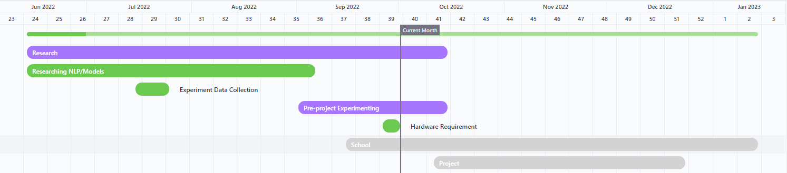
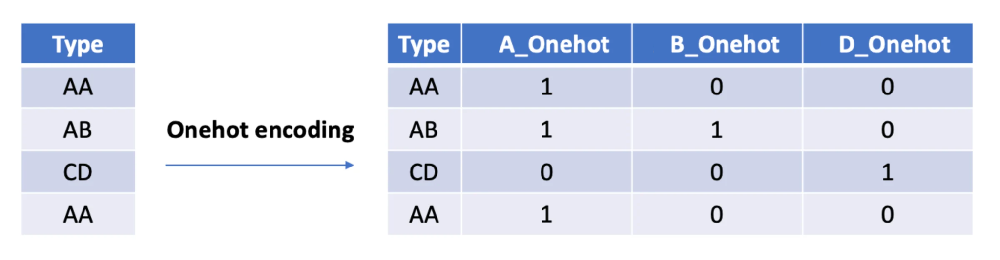

# Multi-Class and Multi-Label

# Text Classification

# Project Plan

### T.C. Adalet Bakanlığı Bilgi İşlem Genel Müdürlüğü

OCTOBER 24 , 2022

PREPARED BY:
BEYZANAZ CAMCIOĞLU
NIMA KAMALI LASSEM

13 JUNE TO 26 DECEMBER 2020


## Table of Contents

- Research (June 13 - October 14)
- School (September 15 - January 13)
- Project (October 11 - December 23)
- Research and School GanttCharts
- Project GanttChart
   - Multi-Class Text Classification Steps:
      - 1. Install Tensorflow Library
      - 2. Install Transformers Library
      - 3. Import Necessary Libraries
      - 4. Create a suitable Dataset
      - 5. Read the Dataset into a Dataframe
      - 6. Prepare Data
      - 7. Prepare Model
      - 8. Using the model
   - Multi-Label Text Classification
- References


## Internship Project Plan

Beyzanaz Camcıoğlu and Nima Kamali Lassem internship from June 13 to December 26, 2022.


The following project plan consists of three main sections:

1. Research: The research phase of the project we have been performing since June 13, 2022.
2. School: The school (CTIS) department-related tasks like follow-up meetings started on
    September 15, 2022.
3. Project: The steps we predict we will take toward completing the project by December 23, 2022.

## Research (June 13 - October 14)



● Researching NLP/Models: Researching NLP concepts and their models to determine the most
suitable for domain-specific problems such as medical and justice domains. The studies included
a search for Train and Test datasets.

● Experiment Data Collection: to fulfill the need for related datasets for the upcoming experiments,
we collected data from various sources, including Kaggle, Twitter, and legal documents. We have
covered more than 250,000 court decisions (mahkeme kararları) and approximately 5 Gigabytes
of public formal (Yargıtay and Danıştay) and informal (Turkish Spam messages) documents.

● Pre-project Experimenting: to prove our findings from our research on NLP, we carried out
experiments on different language models like BERT and fastText. After successfully comparing
the said models and displaying BERT’s lead on the experiment results, we have investigated its
functions and possible outcomes. Up to now, BERTurk-Base-128k has shown promising results
for Binary and Multi-class Text Classifications with accuracy scores of over 95 and 75 percent,
respectively.

● Hardware Requirements: our research showed a minimum GPU RAM size of 16 GB. We were
given remote access to a desktop computer equipped with an RTX A6000 48 GB GPU. We will
request assistance in case of a need for more computing power for the project.

## School (September 15 - January 13)


● Follow-Up Meetings: consist of five assignments regarding work experience.

● Interim Meeting: Presentation of acquired skills and experience to the internship coordinator.

● Company Evaluation and Report Evaluation: Evaluationsforms. 30 Hour workload expected.

● Jury: Presentation of acquired skills and experiences to the jury members after the
internship—January 7th to 13th.

## Project (October 11 - December 23)

**Requirements gathering
Data Collection and Processing**

**Code and Test Weeks**

**Deployment / Final Report**


● **Requirements Gathering:** determination and collection of the functional and non-functional
requirements for the project. Understanding the project aims and goals and choosing resources
and tools to be used for the projects. This task will be accomplished alongside or immediately
followed by Data Collection and Processing.

● **Data Collection and Processing:** similar to the data collection in the experiment phase. As there
are a limited number of resources available in the justice domain, it is expected that we will need
a long time to create or process the previously obtained data to be usable as _“train and test
datasets”_ for the project labeling should be done within the scope of the multi-class text
classification project. We have considered that a labeling application should be made for the
correct labeling of the data, and this application should be designed for labeling processes of law
documents. We found that the most appropriate structure for training is the design of documents
by breaking them down into meaningful sequences and labeling the phrases in accordance with
the sentences they belong. Since BERT works with a limited amount of words in the sequence, we
need to process our data accordingly. The data will be stored in TSV (tab-separated values)
the format in two main columns: sequences and categories (classes). There can be more columns in
the dataset, however, they will not be used in the final program.

● **Code and Test weeks:** we will deliver the project in multiple iterations, facilitating weekly tests to
ensure admissible project results. At the end of each week (Fridays), we will report the week’s
success rate evaluation and issues to be dealt with in the sprint. We will repeat this task until it
produces satisfying results or enters the deployment phase.

● **Deployment / Final Report:** At the end of the internship, we will take action based on the project's
final results. This phase includes saving and deploying the most successful model.

The details on this document are subject to change. Adjustments are
to be performed in the upcoming days.


> **Research (June 13 - October 14) - Gantt**


> **Project (October 11 - December 23) - Gantt**


### Multi-Class Text Classification Steps:

#### 1. Install Tensorflow Library

To make sure the TensorFlow library will have access to the GPU, we need to sync the Python,
cudnn, and CUDA versions. Up to now, October 24th 2022, the latest matching versions of each
requirement.

```
TF Version        | Python version | Compiler  | Build tools | cuDNN | CUDA
tensorflow-2.10.0 | 3.7-3.10       | GCC 9.3.1 | Bazel 5.1.1 | 8.1   | 11.2
```
#### 2. Install Transformers Library

```
!pip install transformers
```
#### 3. Import Necessary Libraries


Tensorflow or PyTorch can be used in the project. As a result of the experiments, the functions
used by Tensorflow to fit the data into the model were found to be more efficient. The Pandas
library will be used to read the data from the file and store it in a data structure. Numpy library to
create and manage arrays quicker.
```
import pandas as pd
import numpy as np
from tqdm.auto import tqdm
import tensorflow as tf
```
#### 4. Create a suitable Dataset


BERT’s default labeling format is to have items (sentence, category) in the first row and the
column order as “label” and “sentence” respectively. As our program will automatically assign
binary labels to the dataset it is better to form our dataset columns like “sentence, category”:


#### 5. Read the Dataset into a Dataframe

Since the document type is TSV, the separator should be defined as ‘\t’ while using the read_csv
function.
```
df = pd.read_csv(DATASET_PATH, sep='\t')
```
#### 6. Prepare Data
● Drop Unused Columns
```
df.drop( 118202 , inplace= **True** )
df['category'] = df['category'].astype(int)
```

● Set int values to the categories (in case they are not int64)

We have 5 classes/categories in this example
```

df['category'].value_counts()
Out[ 34 ]:
2.0 60920 ← NUMBER OF SENTENCES IN CATEGORY (CLASS) #2
3.0 24903
1.0 20160
4.0 6884
0.0 5335
Name: Sentiment, dtype: int

```
● Download your preferred model’s Tokenizer
```
tokenizer = BertTokenizer.from_pretrained('dbmdz/bert-base-turkish-128k-cased')
```
● Create “Input IDs” and “Attention Mask” tensors for the tokenized data
sequence_size = 256
```
X_input_ids = np.zeros((len(df), sequence_size))
X_attn_masks = np.zeros((len(df), sequence_size))
```
● Create Tokenizer Module
```
def generate_training_data(df, ids, masks, tokenizer):
    for i, text in tqdm(enumerate(df['sentence'])):
        tokenized_text = tokenizer.encode_plus(
            text,
            max_length=sequence_size , 
            truncation=True, 
            padding='max_length', 
            add_special_tokens=True,
            return_tensors='tf'
        )
        ids[i, :] = tokenized_text.input_ids
        masks[i, :] = tokenized_text.attention_mask
    return ids, masks
```

● Tokenize Dataset
```
X_input_ids, X_attn_masks =generate_training_data(df,X_input_ids,X_attn_masks,tokenizer)
```

● Create “labels” tensor
```
number_of_classes = 5
labels = np.zeros((len(df), number_of_classes))
labels.shape

Out[ 54 ]:
( 118202 , 5 )
```
● One-Hot encoded target tensor
```
In [ 61 ]:
labels[np. arange(len(df)), df['Sentiment']. values] = 1
```

“One hot encoding is one method of converting data to prepare it for an algorithm and get a better
prediction. With one-hot, we convert each categorical value into a new categorical column and assign a
binary value of 1 or 0 to those columns. Each integer value is represented as a binary vector. All the
values are zero, and the index is marked with a 1.”


Take a look at this chart for a better understanding:


Or in our case:
```

labels

Out[61]:
array([[0., 1., 0., 0., 0.],
       [0., 0., 1., 0., 0.],
       [0., 0., 1., 0., 0.],
       ...,
       [0., 1., 0., 0., 0.],
       [0., 0., 0., 0., 1.],
       [0., 0., 0., 0., 1.]])
```
● Create a data pipeline using tensorflow dataset utility, creates batches of data for easy loading...
```
dataset = tf.data.Dataset.from_tensor_slices((X_input_ids, X_attn_masks, labels))
dataset.take( 1 ) # one sample data
Out[ 66 ]:
<TakeDataset shapes: (( 256 ,), ( 256 ,), ( 5 ,)), types:(tf.float64, tf.float64,
tf.float64)>
```
● Create a Map Module
```
def MCTCDatasetMapFunction (input_ids, attn_masks, labels):
return {
'input_ids': input_ids,
'attention_mask': attn_masks
}, labels
```
● Perform Mapping
```
dataset = dataset.map(MCTCDatasetMapFunction)
dataset.take( 1 )
Out[ 69 ]:
<TakeDataset shapes: ({input_ids: ( 256 ,), attention_mask: ( 256 ,)}, ( 5 ,)), types:
({input_ids: tf.float64, attention_mask: tf.float64}, tf.float64)>

```
● Set batch size, drop any left out tensor, shuffle the dataset to improve accuracy.
Shuffling is done so that BERT does not try to find a connection between the sequences that were
created from the same sentence. For example, “I will not sleep tonight” can be broken down to A
(“sleep tonight”), and B (“I will not”). There is no connection between A and B but if they are put
next to each other BERT might think there has to be a connection.
```
dataset = dataset.shuffle(10000).batch(16, drop_remainder=True)
```
● Divide your dataset to Train and Validation sets (Recommend the Train set to be %80 of the total)
```
p = 0.8
train_size = int((len(df)//16)*p) # for each 16 batch of data we will have len(df)//16 samples, take 80% of that for train.

In [75]:
train_size

Out[75]:
5909

In [76]:
train_dataset = dataset.take(train_size)
val_dataset = dataset.skip(train_size)
```
### 7. Prepare Model
● Download your preferred Model
```
from transformers import TFBertModel

In [ 80 ]:
model = TFBertModel.from_pretrained('dbmdz/bert-base-turkish-128k-cased')
# BERTurk base model 128k with pretrained weights
```
● Define Layers for input_ids and attn_masks
```
input_ids = tf.keras.layers.Input(shape=(sequence_size,), name='input_ids',
dtype='int32')
attn_masks = tf.keras.layers.Input(shape=(sequence_size,), name='attention_mask',
dtype='int32')

bert_embds = model.bert(input_ids, attention_mask=attn_masks)[ 1 ] # 0 -> activation
layer (3D), 1 -> pooled output layer (2D)
intermediate_layer = tf.keras.layers.Dense(sequence_size*2, activation='relu',
name='intermediate_layer')(bert_embds)
output_layer = tf.keras.layers.Dense(number_of_classes, activation='softmax',
name='output_layer')(intermediate_layer) # softmax -> calcs probs of classes

mctc_model = tf.keras.Model(inputs=[input_ids, attn_masks], outputs=output_layer)
mctc_model.summary()

Out [ 88 ]:
Model:"model"
______________________________________________________________________________________
 Layer (type)                   Output Shape         Param #     Connected to                     
======================================================================================
 input_ids (InputLayer)         [(None, 256)]        0           []                               
                                                                                                  
 attention_mask (InputLayer)    [(None, 256)]        0           []                               
                                                                                                  
 bert (TFBertMainLayer)         TFBaseModelOutputWi  108310272   ['input_ids[0][0]',              
                                thPoolingAndCrossAt               'attention_mask[0][0]']         
                                tentions(last_hidde                                               
                                n_state=(None, 256,                                               
                                 768),                                                            
                                 pooler_output=(Non                                               
                                e, 768),                                                          
                                 past_key_values=No                                               
                                ne, hidden_states=N                                               
                                one, attentions=Non                                               
                                e, cross_attentions                                               
                                =None)                                                            
                                                                                                  
 intermediate_layer (Dense)     (None, 512)          393728      ['bert[0][1]']                   
                                                                                                  
 output_layer (Dense)           (None, 5)            2565        ['intermediate_layer[0][0]']     
                                                                                                  
======================================================================================
Total params: 108,706,565
Trainable params: 108,706,565
Non-trainable params: 0
______________________________________________________________________________________

```
● Set “Optimization”, “Loss”, and “Accuracy” modules available on the tensorflow library
```
optim = tf.keras.optimizers.Adam(learning_rate=1e-5, decay=1e-6)
loss_func = tf.keras.losses.CategoricalCrossentropy()
acc = tf.keras.metrics.CategoricalAccuracy('accuracy')
```
● Save the model
```
MCTC_model.save('MCTC_model')
```
### 8. Using the model
● Load the Model and its Tokenizer
```
MCTC_model = tf.keras.models.load_model('MCTC_model')

tokenizer = BertTokenizer.from_pretrained('dbmdz/bert-base-turkish-128k-cased')
#You can save your own tokenizer using tokenizer.save_pretrained(PATH)
```
● Create a Data Preparation Module
```
def prepare_data(input_text, tokenizer):
    token = tokenizer.encode_plus(
        input_text,
        max_length=256, 
        truncation=True, 
        padding='max_length', 
        add_special_tokens=True,
        return_tensors='tf'
    )
    return {
        'input_ids': tf.cast(token.input_ids, tf.float64),
        'attention_mask': tf.cast(token.attention_mask, tf.float64)
    }

```
● Prepare a Predict Module (Enter Class names)
```
def make_prediction(model, processed_data, classes=['A', 'B', 'C', 'D', 'E']):
    probs = model.predict(processed_data)[0]
    return classes[np.argmax(probs)]
```
● Run the model
```
input_text = input('Enter sentence: ')
processed_data = prepare_data(input_text, tokenizer)
result = make_prediction(sentiment_model, processed_data=processed_data)
print(f"Predicted Class: {result}")
```
```
'''
^ This is the output of the previous line ^
'''

Enter a sentence: "This belongs to B Class"


Predicted Class: B

'''
^ RESULT ^
'''
```


## Multi-Label Text Classification

Multi-Label Text Classification is very similar to the [Multi-Class Text Classification]{.ul} {page 6} task weelaborated earlier in this document. The only difference is that an item (sentence) can belong to **one ormore** classes (categories). Therefore, the **one-hot encoding** of this task would look like this**:**

{width="7.083333333333333in"
height="1.8430544619422573in"}

As you see, A belongs to multiple types here, resulting in A being True for more than one class. Suchmodel could provide us with alternatives or probabilities for each class, thus, it can be useful in casesthat the answer might not always be definitive.

## References

  ----- -------------------------------------------------------------------------------------------------------------
  1\.   A. Fawcett, "Data Science in 5 minutes: What is one hot encoding?," *Educative*. \[Online\]. Available: https://www.educative.io/blog/one-hot-encoding
  ----- -------------------------------------------------------------------------------------------------------------
  2\.   Theartificialguy, "NLP-with-deep-learning/bert at master theartificialguy/NLP-with-deep-learning," *GitHub*. \[Online\]. Available: https://github.com/theartificialguy/NLP-with-Deep-Learning/tree/master/BERT
  ----- ---------------------------------------------------------------
